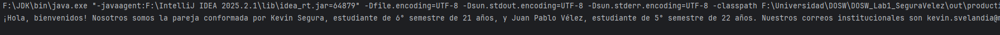
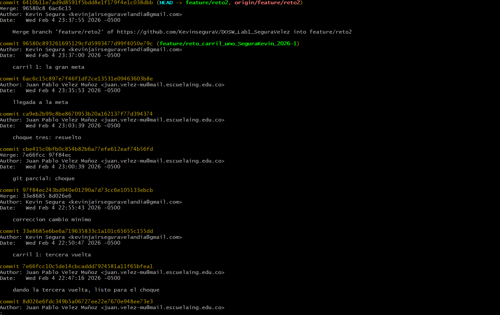
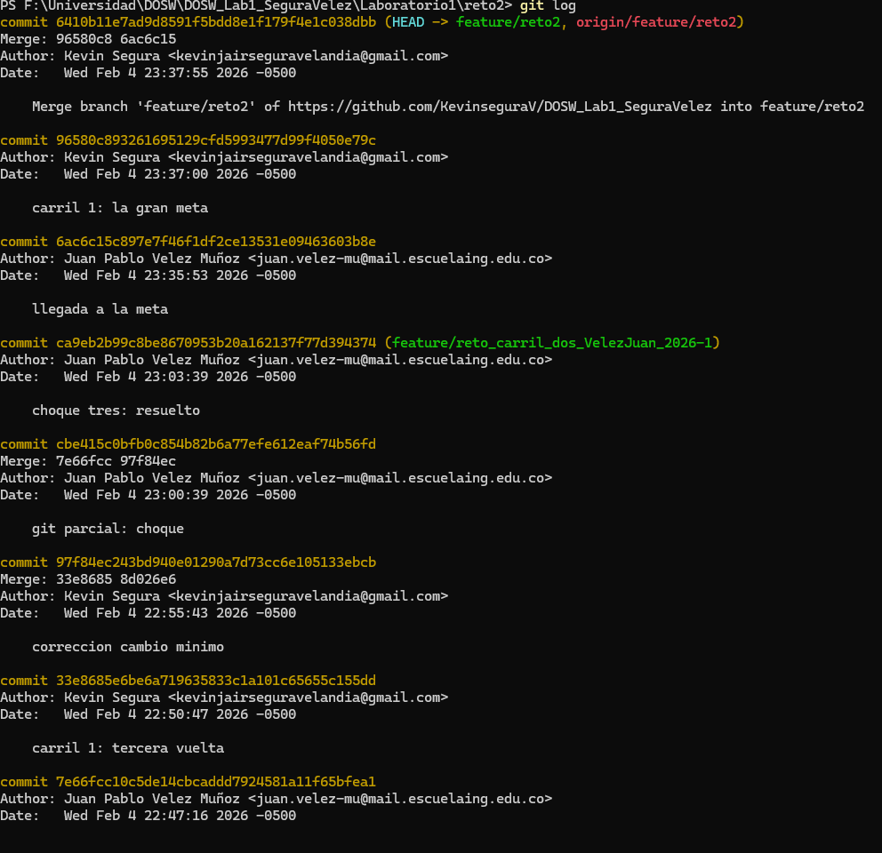
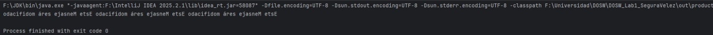
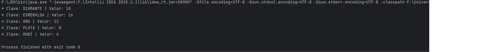
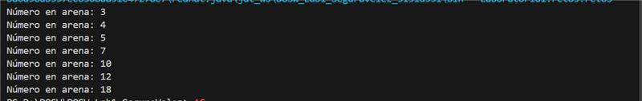

# 🏁 Git Maratón 2026-1

## 👥 Integrantes
- **Kevin Segura Velandia**
- **Juan Pablo Vélez**

---

## 🧩 Retos Completados

### 🟢 Reto 1: Configuración y creación de la rama

**Evidencia:**  

---

### 🟡 Reto 2: Carrera en Paralelo

**Descripción:**  
El reto se resolvió mediante trabajo en paralelo usando ramas en Git.  
Desde una rama *feature*, se crearon dos carriles donde se implementaron funcionalidades distintas utilizando expresiones *lambda*.  
Los conflictos de *merge* generados fueron resueltos correctamente, integrando los cambios en una única función que procesa dos listas de números y retorna un objeto `Resultados` con los valores máximos, mínimos, cantidad de elementos y sus validaciones (par/impar y múltiplo/divisor de 2).  
El historial de *commits* evidencia el desarrollo paralelo y la correcta fusión de las ramas.

**Evidencias:**  
  

---

### 🔵 Reto 3: El eco misterioso

**Descripción:**  
Resolvimos el reto trabajando en ramas separadas desde `develop`.  
Uno de nosotros implementó la repetición del mensaje tres veces usando `Stream`, expresiones *lambda* y `StringBuilder`, mientras que el otro implementó la inversión del mensaje usando `StringBuffer`.  
Al utilizar el mismo método se generó un conflicto, el cual resolvimos integrando ambas soluciones en una sola función que primero repite el mensaje y luego lo invierte, cumpliendo con lo solicitado.

**Evidencia:**  

---

### 🔵 Reto 4: El tesoro de las llaves duplicadas

**Descripción:**  
Resolvimos el reto trabajando en paralelo desde ramas separadas. Uno de nosotros implementó el manejo de pares clave-valor utilizando HashMap,
ignorando claves duplicadas y conservando el primer valor, mientras que el otro utilizó Hashtable para garantizar la sincronización.
Ambos desarrollamos métodos con el mismo nombre, lo que generó un conflicto que resolvimos unificando la lógica en una sola función que combina ambos mapas,
prioriza los valores del Hashtable en caso de conflicto, convierte las claves a mayúsculas y las imprime en orden ascendente utilizando Stream,
Collectors.toMap() y expresiones lambda.

**Evidencia:**  

### 🔵 Reto 5: Batalla de Conjuntos

**Descripción:**  
Resolvimos el reto trabajando en paralelo desde ramas separadas. Uno de nosotros utilizó un HashSet para almacenar números sin orden y eliminar los múltiplos de 3, mientras que el otro utilizó un TreeSet para almacenar los números en orden natural y eliminar los múltplos de 5. Posteriormente unimos ambas colecciones en una sola estructura ordenada, eliminando duplicados, y mostramos el resultado final utilizando stream().filter() y expresiones lambda, resolviendo los conflictos generados durante el proceso de merge.

**Evidencia:**  

